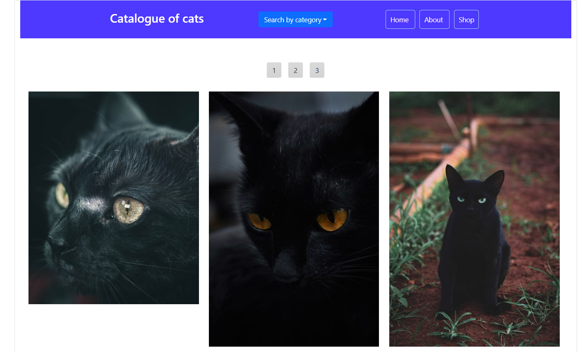

# React - Redux - Catalogue Project

This project is part of the React-Redux chapter in the Microverse Program.
In this project we develop the knowledge to use React and Redux together to create a catalogue page using API to fetch images.

I use yarn files and assets.

## Built With

- JavaScript
- React 
- Redux

### Linters Used

- Eslint
- Stylelint

## Live Demo - Try the game here

[Live Demo Link](https://react-redux-catalogue-cats.netlify.app/)

## Getting Started

To get a local copy up and follow these simple example steps.

### Prerequisites

- Local Machine installed [Nodejs](https://nodejs.org/en/download/)
- Yarn as a package manager
- A code editor as [Visual Studio](https://code.visualstudio.com/download), Sublime,etc.
- To be able to have the project working on the local environment you need to create a n account and a `new project` on the UNSPLASH API. By doing this, you will be given an API KEY to use it on the project and the PI from Unsplash.
- With this API key you need to create a `.env` file on the root directory and put this `REACT_APP_CATALOGUE_UNSPLASH_API_KEY=` followed by the API key obtained before.

### Setup

- Please make a local copy of this repo by typing this command on your terminal.

`git clone https://github.com/alejandrotoledoweb/react-redux-catalogue.git`

- Then, go to the folder created with:

`cd react-redux-catalogue`

## Available Scripts

In the project directory, you can run:

### `yarn start`

Runs the app in the development mode.\
Open [http://localhost:3000](http://localhost:3000) to view it in the browser.

The page will reload if you make edits.\
You will also see any lint errors in the console.

### `yarn test`

For this project I test the components using the following dependencies:

-
-
-

Before running `yarn test` be sure to run `npm i` to install all dependencies required for tests.

After running `yarn test` you must select one of the options given by Jest.
***For example type `a` to run all tests.***

Launches the test runner in the interactive watch mode.\
See the section about [running tests](https://facebook.github.io/create-react-app/docs/running-tests) for more information.

### `yarn build`

Builds the app for production to the `build` folder.\
It correctly bundles React in production mode and optimizes the build for the best performance.

The build is minified and the filenames include the hashes.\
Your app is ready to be deployed!

See the section about [deployment](https://facebook.github.io/create-react-app/docs/deployment) for more information.

### `yarn eject`

**Note: this is a one-way operation. Once you `eject`, you can’t go back!**

If you aren’t satisfied with the build tool and configuration choices, you can `eject` at any time. This command will remove the single build dependency from your project.

Instead, it will copy all the configuration files and the transitive dependencies (webpack, Babel, ESLint, etc) right into your project so you have full control over them. All of the commands except `eject` will still work, but they will point to the copied scripts so you can tweak them. At this point you’re on your own.

You don’t have to ever use `eject`. The curated feature set is suitable for small and middle deployments, and you shouldn’t feel obligated to use this feature. However we understand that this tool wouldn’t be useful if you couldn’t customize it when you are ready for it.

## Authors

👤  **Alejandro Toledo**

- GitHub: [@alejandrotoledoweb](https://github.com/alejandrotoledoweb)
- Twitter: [@alejot](https://twitter.com/alejot)
- LinkedIn: [Alejandro Toledo](https://www.linkedin.com/in/alejandro-toledo-3b444b109/)

## 🤝 Contributing

Contributions, issues, and feature requests are welcome!

Feel free to check the [issues page](https://github.com/alejandrotoledoweb/react-calculator/issues).

## Show your support

Give a ⭐️ if you like this project!

## Acknowledgments

- Thank you to Microverse, who challenged me to build this app.

## 📝 License

This project is [MIT](lic.url) licensed.
This project was bootstrapped with [Create React App](https://github.com/facebook/create-react-app).
